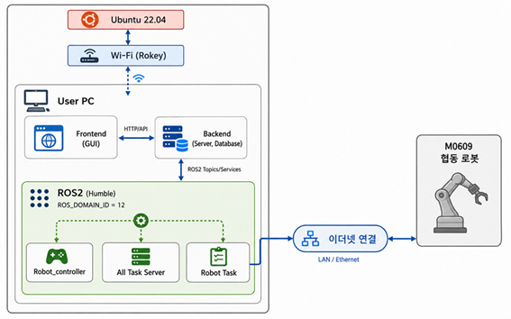
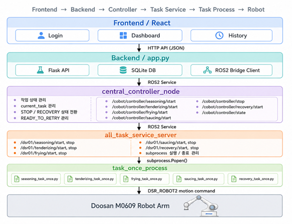
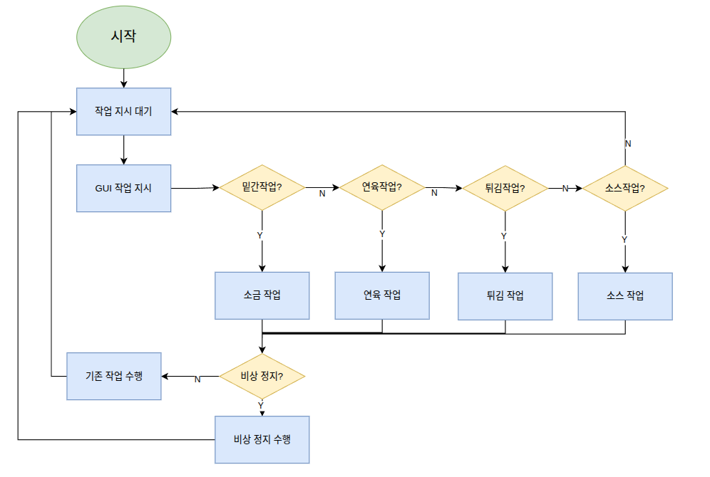

# 🤖 Auto Katz (ROS2 기반 로봇 조리 자동화 공정 시스템)

## 📌 프로젝트 개요
**Auto Katz**는 두산 M0609 협동로봇(Cobot)을 활용하여 돈까스 조리 공정을 자동화한 스마트 시스템입니다. 단순히 정해진 궤적을 이동하는 것을 넘어, 셰프의 미세한 조작을 모사하는 **힘 제어(Force Control)** 및 **비동기 모션 제어** 기술을 적용하여 일관되고 높은 품질의 요리를 제공합니다. 

이 프로젝트는 안정적인 다중 태스크 처리와 비상 상황 대응(Fail-safe) 아키텍처를 구축하여 실제 조리 환경에 투입 가능한 수준의 완성도를 목표로 개발되었습니다.

---

## 🛠 운영 체제 환경 및 기술 스택
- **OS:** Ubuntu 22.04 LTS
- **Middleware:** ROS2 Humble
- **Language:** Python 3.10
- **Frontend:** React (Node.js **v20.12.0**, npm **10.5.0**)
- **Backend:** Flask
- **Vision:** OpenCV, NumPy
---

## 🏗 시스템 아키텍처

1. **Central Controller Node:** 공정의 전반적인 흐름(State Machine)을 제어하고, Subprocess 관리를 통해 다중 태스크를 효율적으로 스케줄링합니다.
2. **Task Server Nodes:** 시즈닝, 연육, 튀김, 소스 도포 등 세부 공정을 담당하는 ROS2 Action/Service 서버.
3. **Web Interface:** React 기반 프론트엔드와 Flask 기반 백엔드가 통신하며, 사용자에게 실시간 공정 상태를 모니터링하고 제어 명령(`ros2_bridge`)을 내릴 수 있는 직관적인 대시보드를 제공합니다.


## System Architecture


## Node System Architecture


## Flow Chart

---

## ✨ 주요 기능 및 기술적 성과

### 1. 셰프의 손목 스냅 모션 구현 (Seasoning)
- `amove_periodic`(비동기 제어)을 활용하여 작업자의 손목 스냅 동작과 유사한 부드럽고 자연스러운 흔들기 궤적을 구현했습니다.
- **Safe Wait (0.2초 분할 감시):** 동작 중 0.2초 단위로 로봇의 상태 및 충돌 여부를 실시간으로 감지하여 안전성을 극대화했습니다.

### 2. 적응형 Z축 순응 제어 (Tenderizing)
- **Compliance Control (순응 제어):** 식재료(고기)의 두께 변화에도 일정한 압력으로 연육 작업을 수행할 수 있도록 Z축 방향으로 8N의 힘을 감지/유지하는 제어를 적용했습니다.
- 8자 롤링 궤적 생성 알고리즘을 결합하여 고기의 조직을 균일하게 두드리고 부드럽게 만드는 효과를 극대화했습니다.

### 3. 비동기 중간 정지 및 진동 제어 (Frying)
- 조리 시간 및 튀김 상태를 고려한 비동기 제어를 통해 기름 속에서 45도 기울어진 상태로 대기(Flip 전 중간 정지)하도록 설계했습니다.
- 튀김 완료 후 로봇 바스켓의 미세 진동을 동적으로 제어하여, 표면의 기름을 효과적이고 뭉침 없이 털어내는 동작을 성공적으로 구현했습니다.

### 4. 이미지 처리 기반 그림 궤적 생성 (Saucing)
- **OpenCV 영상 처리:** 소스 도포 대상의 이미지를 획득 후, 이진화 및 형태학적 연산 등 이미지 처리를 통해 추출 대상의 컴포넌트를 추출합니다.
- 추출된 이미지 픽셀 좌표를 로봇의 실공간 TCP 이동 좌표(CSV)로 자동 변환 및 매핑함으로써, 다양한 그림에 적용될 수 있도록 소스 도포 경로를 생성합니다.

### 5. 다중 프로세스 및 Fail-safe 아키텍처 (Emergency Recovery)
- **Central Controller Node** 를 통해 상태 기반 공정 시스템을 구축하여 복잡한 서비스 통신 시스템과 다중 공정 작업을 꼬임 없이 안정적으로 실행합니다.
- **비상 정지 시스템 및 복구 처리** 를 통해 비상 또는 예상치 못한 상황 발생 시, 사용자는 GUI에서 비상 정지 버튼을 눌러 예외 상황을 안전하게 처리한다. 정지 신호로 로봇이 작업을 중지하면, 복구 작업으로 작업을 재게할 수 있는 상태로 되돌려 강건한 시스템을 구축했습니다.
- **그리퍼 상태 모니터링:** 그리퍼의 디지털 I/O를 활용해 파지 상태(Gripper Status)를 지속적으로 감지합니다. 만약 이동 중 대상물을 놓치거나 비정상적인 파지가 발생할 경우, 동작을 즉각 중지하고 맞춤형 예외 처리 및 자동 복구 로직(Recovery Task)이 실행되는 견고한 아키텍처를 구축했습니다.

---

## 🚀 설치 및 실행 방법

### 1. 의존성 설치
Python 환경에 필요한 패키지들을 설치합니다.
```bash
pip install -r requirements.txt
```

### 2. 빌드 및 환경 설정 (ROS2)
```bash
cd <your_workspace>
colcon build --packages-select cobot1_project
source install/setup.bash
```

### 3. 시스템 실행
프론트엔드, 백엔드 및 ROS2 메인 컨트롤러를 순차적으로 실행하여 시스템을 구동합니다. (상세 실행 스크립트 및 런치 파일 구성에 따라 변경될 수 있습니다)

**ROS2 메인 컨트롤러 실행:**
```bash
ros2 run cobot1_project central_controller1_1_ch
ros2 run cobot1_project all_task_service_server
```
*(기타 Task Node들 및 `ros2_bridge` 실행 필요)*

**Backend 실행:**
```bash
# Flask 서버 구동
ros2 run cobot1_project app2_1_ch
```

**Frontend 실행:**
```bash
cd frontend
npm install
npm run dev
```
